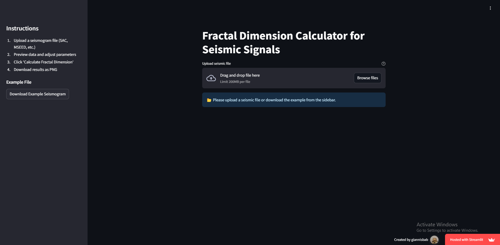
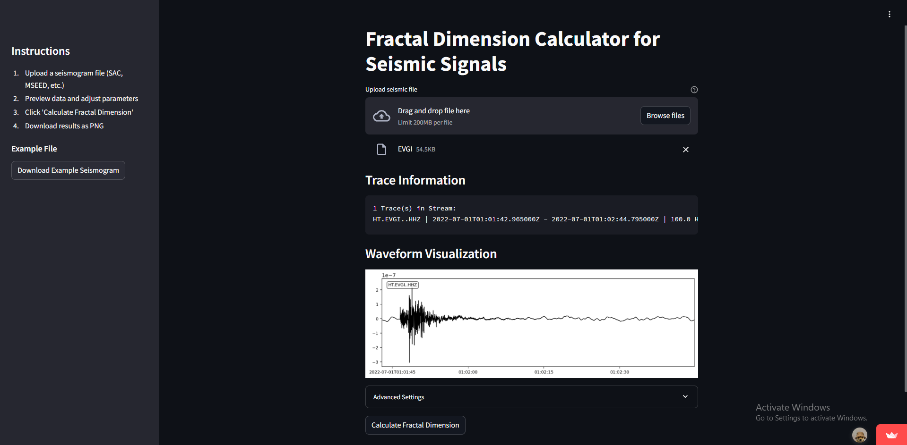
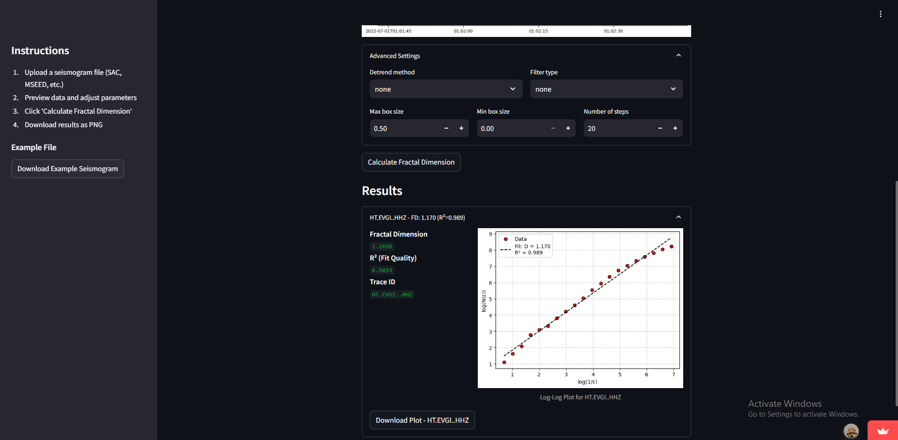

# Seismic Fractal Dimension Calculator 🌍

[](https://seismic-fractal-dimension-calculator.streamlit.app/)
[](https://www.python.org/)

🔗 **Online Demo**: [https://seismic-fractal-dimension-calculator.streamlit.app/](https://seismic-fractal-dimension-calculator.streamlit.app/)

---

## 🌟 Χαρακτηριστικά

- Υποστήριξη μορφών αρχείων: **SAC, MSEED**.
- Προεπεξεργασία σημάτων: Detrending (none/linear/demean), φιλτράρισμα (lowpass/highpass/bandpass).
- Απεικόνιση αποτελεσμάτων με διαγράμματα και R² score.
- Δυνατότητα λήψης γραφημάτων ως PNG.

---

## ⚙️ Εγκατάσταση

1. Κλωνοποιήστε το repository:
   ```bash
   git clone https://github.com/GiannisBab/Seismic-Fractal-Dimension-Calculator.git
   ```
2. Εγκαταστήστε τις απαιτούμενες βιβλιοθήκες:
   ```bash
   pip install -r requirements.txt
   ```
3. Μεταβείτε στον φάκελο:
   ```bash
   cd Seismic-Fractal-Dimension-Calculator
   ```
4. Εκκινήστε την εφαρμογή:
   ```bash
   streamlit run app.py
   ```

---

## 🛠️ Χρήση

1. **Μεταφορτώστε ένα σεισμογραφικό αρχείο** (ή χρησιμοποιήστε το [παράδειγμα EVGI](example/EVGI)).
2. **Ρυθμίστε τις παραμέτρους προεπεξεργασίας μέσω της διεπαφής.** (Προαιρετικό)
3. **Πατήστε **Calculate Fractal Dimension**.**
4. **Κατεβάστε τα αποτελέσματα ως εικόνα PNG.**

---

## 🖼️ Στιγμιότυπα Οθόνης

### Αρχική Οθόνη


### Προεπισκόπηση Σεισμογραφικών Δεδομένων


### Αποτελέσματα Υπολογισμού


---

🙋 **Ερωτήσεις ή προτάσεις**;  
Ανοίξτε ένα [issue](https://github.com/GiannisBab/Seismic-Fractal-Dimension-Calculator/issues) ή επικοινωνήστε μέσω [GitHub Discussions](https://github.com/GiannisBab/Seismic-Fractal-Dimension-Calculator/discussions).
